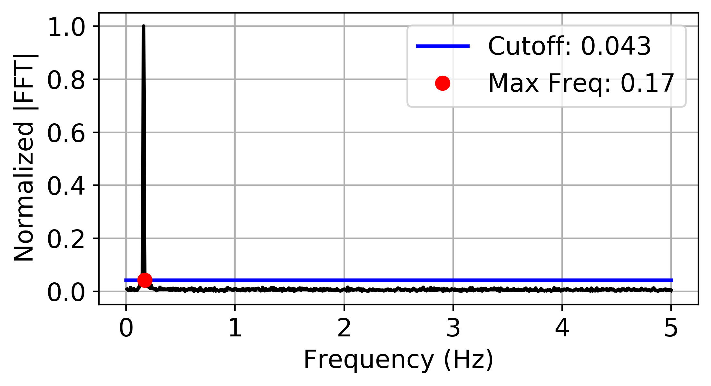

.. automodule:: teaspoon.parameter_selection.delay_LMS
    :members:

The following is an example implementing the statistics of gaussian noise in the fourier spectrum and 
the sampling criteria from On the 0/1 test for chaos in continuous systems by Melosik and Marszalek 
for selecting tau::

    import numpy as np
    
    fs = 10
    t = np.linspace(0, 100, fs*100) 
    ts = np.sin(t) + np.random.normal(0,0.1, len(t))

    tau = LMSforDelay(ts, fs, plotting = True)
    print('Permutation Embedding Delay: ' + str(int(tau)))

Where the output for this example is::

    Permutation Embedding Delay: 19

