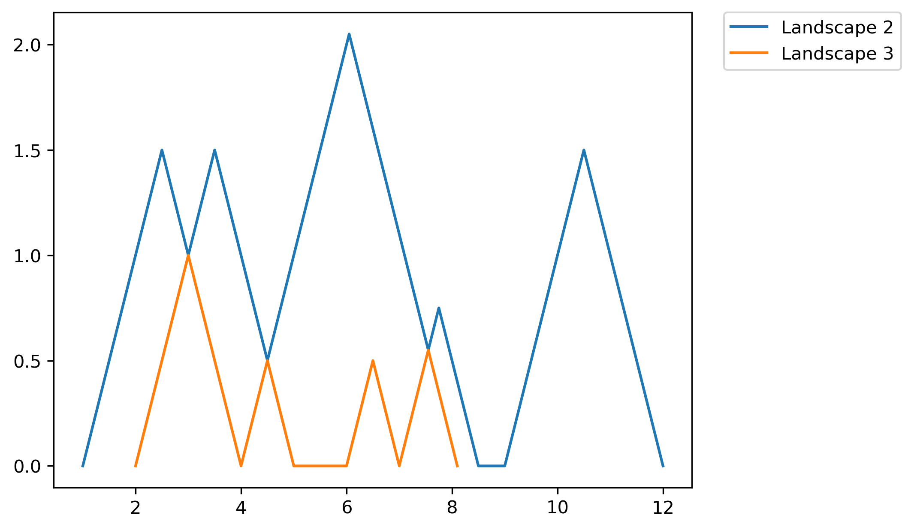
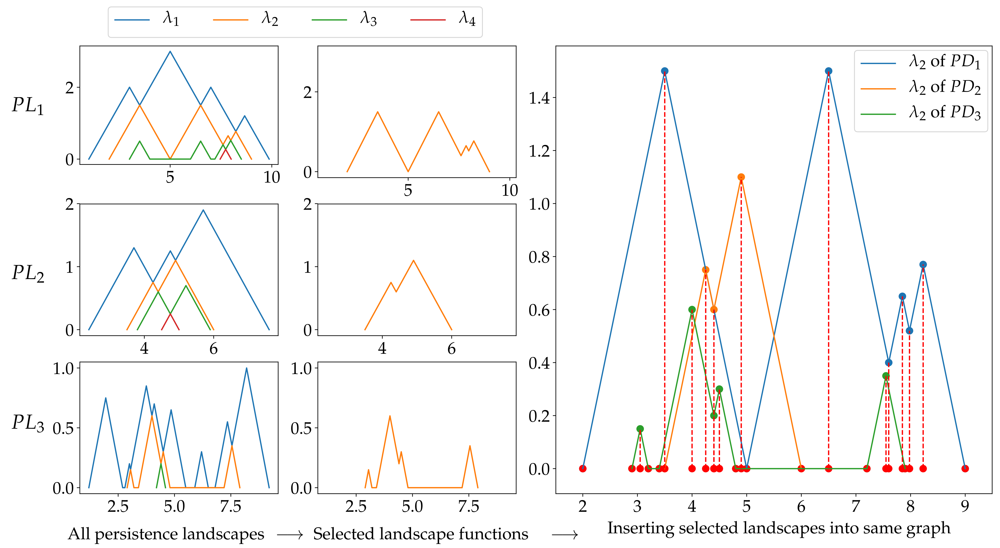

.. _featurization:

=============
Featurization
=============
This documentation includes five different persistence diagram featurization methods.
These are persistence landscapes, persistence images, Carlsson Coordinates, kernel method, and signature of paths.

.. _persistence_landscapes:

Persistence Landscapes
----------------------

Landscape class
~~~~~~~~~~~~~~~

.. autoclass:: teaspoon.ML.feature_functions.PLandscape
    :members: 
    :undoc-members:
    :private-members:
    :special-members: __init__

**Example:** In this example, we do not specify which landscape function we want specifically. Therefore, algorihtms returns a warning to user if desired landscape points is wanted. 
    	
	>>> import numpy as np
	>>> from teaspoon.ML.feature_functions import PLandscape
	>>> a=[]
	>>> a.append(np.array([(1,5),(1,4),(2,14),(3,4),(4,8.1),(6,7),(7,8.5),(9,12)]))
  	>>> PLC = PLandscape(a[0])
	>>> print(PLC.PL_number)
	4
	>>> print(PLC.AllPL)
	   Landscape Number                                             Points
	0               1.0  [[1.0, 0.0], [3.0, 2.0], [3.5, 1.5], [8.0, 6.0...
	1               2.0  [[1.0, 0.0], [2.5, 1.5], [3.0, 1.0], [3.5, 1.5...
	2               3.0  [[2.0, 0.0], [3.0, 1.0], [4.0, 0.0], [4.5, 0.5...
	3               4.0               [[3.0, 0.0], [3.5, 0.5], [4.0, 0.0]]
	>>> print(PLC.DesPL)
	Warning: Desired landscape numbers were not specified.
	>>> fig = PLC.PLandscape_plot(PLC.AllPL['Points'])

Output of the plotting functions is:

.. figure:: figures/All_Landscapes.png
   :align: center
   :scale: 25 %

   All landscape functions for the given persistence diagram
   
If user specify the desired landscapes, output will be:

	>>> PLC  = PLandscape(a[0],[2,3])
	>>> print(PLC .PL_number)
	4
	>>> print(PLC .AllPL)
		Landscape Number                                             Points
	0               1.0  [[1.0, 0.0], [3.0, 2.0], [3.5, 1.5], [8.0, 6.0...
	1               2.0  [[1.0, 0.0], [2.5, 1.5], [3.0, 1.0], [3.5, 1.5...
	2               3.0  [[2.0, 0.0], [3.0, 1.0], [4.0, 0.0], [4.5, 0.5...
	3               4.0               [[3.0, 0.0], [3.5, 0.5], [4.0, 0.0]]
	>>> print(PLC .DesPL)
	[array([[ 1.  ,  0.  ],
		[ 2.5 ,  1.5 ],
		[ 3.  ,  1.  ],
		[ 3.5 ,  1.5 ],
		[ 4.5 ,  0.5 ],
		[ 6.05,  2.05],
		[ 7.55,  0.55],
		[ 7.75,  0.75],
		[ 8.5 ,  0.  ],
		[ 9.  ,  0.  ],
		[10.5 ,  1.5 ],
		[12.  ,  0.  ]])
	array([[2.  , 0.  ],
		[3.  , 1.  ],
		[4.  , 0.  ],
		[4.5 , 0.5 ],
		[5.  , 0.  ],
		[6.  , 0.  ],
		[6.5 , 0.5 ],
		[7.  , 0.  ],
		[7.55, 0.55],
		[8.1 , 0.  ]])]
	>>> PLC.PLandscape_plot(points['Points'])

Output of the plotting functions is:
	

   Chosen landscape functions for the given persistence diagram

.. _PB_Landscape:
   
Parameter bucket for landscapes
~~~~~~~~~~~~~~~~~~~~~~~~~~~~~~~  
   
.. autoclass:: teaspoon.ML.Base.LandscapesParameterBucket
    :members:
    :undoc-members:
    :private-members:
    :special-members: __init__

**Example:** If user does not provide classification labels, parameter bucket will return a warning as shown below.
 
	>>> from teaspoon.ML.Base import LandscapesParameterBucket
	>>> from sklearn.svm import LinearSVC
	>>> from termcolor import colored
	>>> params = LandscapesParameterBucket()
	>>> params.clf_model = LinearSVC
	>>> params.test_size =0.5
	>>> params.Labels = None
	>>> params.PL_Number = [2]
	>>> print(params)
	Variables in parameter bucket
	-----------------------------
	clf_model : <class 'sklearn.svm._classes.LinearSVC'>
	feature_function : <function F_Landscape at 0x000001F6AB9F6558>
	PL_Number : [2]
	Labels : None
	test_size : 0.5
	-----------------------------
	Warning: Classification labels are missing.

Feature matrix generation  
~~~~~~~~~~~~~~~~~~~~~~~~~

.. _F_Matrix:

   Feature matrix generation steps explained with an simple example.

:numref:`F_Matrix` explains the steps for generation feature matrix using persistence landscapes. There are three persistence landscape sets for three different persistence diagram. 
We choose one landscape function among them. In the example above, second landscape function is selected and plotted for each landscape set.
The plot in the third column includes all selected landscape functions. 
In other words, we plot all selected landscapes in same figure.
The next step is to find the mesh points using node points of landscapes. 
Node points are projected on x-axis.
The red dots in the plot represent these projections.
Then, we sort these points (red dots) and remove the duplicates if there is any.
Resulting array will be our mesh and it is used to obtain features.
The mesh points is shown in :numref:`Mesh` with red dots.
There may not be corresponding y value for each mesh points in selected landscape functions so we use linear interpolation to find these values.
Then, these y values become the feature for each landscape functions, and they can be used in classification.

.. _Mesh:

.. figure:: figures/Mesh_Points.png
   :align: center
   :scale: 20 %

   Mesh obtained using second landscape function for the example provided in :numref:`F_Matrix`.

.. automodule:: teaspoon.ML.feature_functions
    :members: F_Landscape
    :undoc-members:
    :private-members:
    :special-members:

.. _persistence_images:
	
Persistence Images
------------------
	
.. currentmodule:: teaspoon.ML.feature_functions
.. autofunction:: F_Image
	

**Example:**
	
	>>> import numpy as np
	>>> import matplotlib.pyplot as plt
	>>> from teaspoon.ML.feature_functions import F_Image
	>>> PD=[]
	>>> PD.append(np.array([(1,5),(1,4),(2,14),(3,4),(4,8.1),(6,7),(7,8.5),(9,12)]))
	>>> PD.append(np.array([(1.2,3.6),(2,2.6),(2,7),(3.7,4),(5,7.3),(5.5,7),(9,11),(9,12),(12,17)]))
	>>> plot = False
    	>>> TF_Learning = False
   	>>> D_Img = []
    	>>> feature_PI = F_Image(PD,0.01,0.15,plot,TF_Learning,D_Img)
	# if user wants to plot images
   	>>> plot=True
	>>> feature_PI = F_Image(PD,0.01,0.15,plot,TF_Learning,D_Img)

The algorithm will return two images as shown in :numref:`PI_Example`.

.. _PI_Example:

.. figure:: figures/PI_Example.png
   :align: center
   :scale: 20 %

.. _carlsson_coordinates:

Carlsson Coordinates
--------------------

.. currentmodule:: teaspoon.ML.feature_functions
.. autofunction:: F_CCoordinates

**Example:**
	
	>>> import numpy as np
	>>> from teaspoon.ML.feature_functions import F_CCoordinates
	>>> PD=[]
	>>> PD.append(np.array([(1,5),(1,4),(2,14),(3,4),(4,8.1),(6,7),(7,8.5),(9,12)]))
	>>> PD.append(np.array([(1.2,3.6),(2,2.6),(2,7),(3.7,4),(5,7.3),(5.5,7),(9,11),(9,12),(12,17)]))
	>>> FN=3
	>>> FeatureMatrix,TotalNumComb,CombList = F_CCoordinates(PD,FN)
	>>> print(TotalNumComb)
	7
	>>> print(CombList)
	[[1. 0. 0. 0. 0.]
	 [2. 0. 0. 0. 0.]
	 [3. 0. 0. 0. 0.]
	 [1. 2. 0. 0. 0.]
	 [1. 3. 0. 0. 0.]
	 [2. 3. 0. 0. 0.]
	 [1. 2. 3. 0. 0.]]	

.. _path_signatures:

Path Signatures
---------------

.. currentmodule:: teaspoon.ML.feature_functions
.. autofunction:: F_PSignature	 

**Example:**
	
	>>> import numpy as np
	>>> from teaspoon.ML.feature_functions import PLandscape,F_PSignature
	>>> PD=[]
	>>> PD.append(np.array([(1,5),(1,4),(2,14),(3,4),(4,8.1),(6,7),(7,8.5),(9,12)]))
	>>> PD.append(np.array([(1.2,3.6),(2,2.6),(2,7),(3.7,4),(5,7.3),(5.5,7),(9,11),(9,12),(12,17)]))
	>>> PerLand=np.ndarray(shape=(2),dtype=object)
	>>> for i in range(0, 2):
	>>> 	Land=PLandscape(a[i])
	>>> 	PerLand[i]=Land.AllPL
	>>> L_number = [2]
	>>> feature_PS = F_PSignature(PerLand,L_number)

Kernel Method
-------------

.. currentmodule:: teaspoon.ML.feature_functions
.. autofunction:: KernelMethod

**Example:**

	>>> from teaspoon.ML.feature_functions import KernelMethod
	>>> import numpy as np
	>>> PD=[]
	>>> PD.append(np.array([(1,5),(1,4),(2,14),(3,4),(4,8.1),(6,7),(7,8.5),(9,12)]))
	>>> PD.append(np.array([(1.2,3.6),(2,2.6),(2,7),(3.7,4),(5,7.3),(5.5,7),(9,11),(9,12),(12,17)]))
	>>> perDgm1 = PD[0]
	>>> perDgm2 = PD[1]
	>>> sigma=0.25
	>>> kernel = KernelMethod(perDgm1, perDgm2, sigma)
	>>> print(kernel)	
	0.9160645485529173