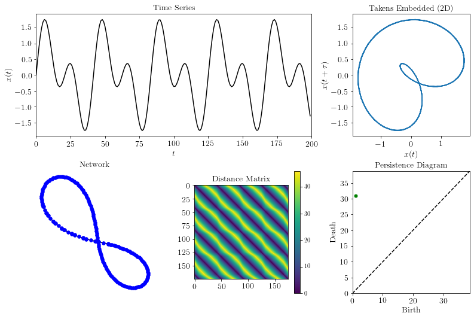

Persistent Homology of Networks (PHN)
======================================

This page provides a summary of the python functions used in in "`Persistent Homology of Complex Networks for Dynamic State Detection <https://arxiv.org/abs/1904.07403>`_" for generating and analyzing complex networks as the Persistent Homology of Networks (PHN). Additionally, a basic example is provided showing the functionality of the method for a simple time series. Below, a simple overview of the method is provided.

.. figure:: figures/process.png
   :scale: 40 %

Outline of method: a time series (a) is embedded (b) using state space reconstruction from Takens' embedding or segmenting the vectors into a set of permutations. From these two representations, an undirected, unweighted network (c) is formed by either applying a kth nearest neighbors algorithm or by setting each permutation state as a node. The distance matrix (d) is calculated using the shortest path between all nodes. The
persistence diagram (e) is generated by applying persistent homology to the distance matrix. Finally, one of several point summaries (f) are used to extract information from the persistence diagram.

.. automodule:: teaspoon.PHN.PHN
    :members:

Examples
#########
The following is an example implementing the method for an ordinal partition network for a simple time series::

    #import needed packages
    import numpy as np
    t = np.linspace(0,30,1000)
    ts = np.sin(t) + np.sin(2*t) #generate a simple time series
    n, tau = 5, 30
    PS, A, D, diagram, statistics = PH_network(ts, tau, n, network = 'ordinal_partition',
                                               method = 'unweighted', distance = 'shortest_path',
                                               plotting = True)
    # PS = permutation sequence, A = adjacency matrix, D = distance matrix, 
    # diagram = persistence diagram, and 
    # statistics =  [maximum persistence ratio, persistent entropy normalized, homology class ratio]

Where the output for this example is

.. figure:: figures/networks_example_OP.png
   :scale: 70 %

The following is an example implementing the method for a k-NN network for a simple time series::

    #import needed packages
    import numpy as np
    t = np.linspace(0,30,200)
    ts = np.sin(t) + np.sin(2*t) #generate a simple time series
    n, tau = 5, 6
    PS, A, D, diagram, statistics = PH_network(ts, tau, n, network = 'knn',
                                               method = 'unweighted', distance = 'shortest_path',
                                               plotting = True)
    # PS = permutation sequence, A = adjacency matrix, D = distance matrix, 
    # diagram = persistence diagram, and 
    # statistics =  [maximum persistence ratio, persistent entropy normalized, homology class ratio]

Where the output for this example is 

