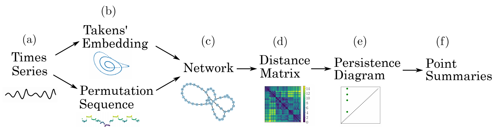
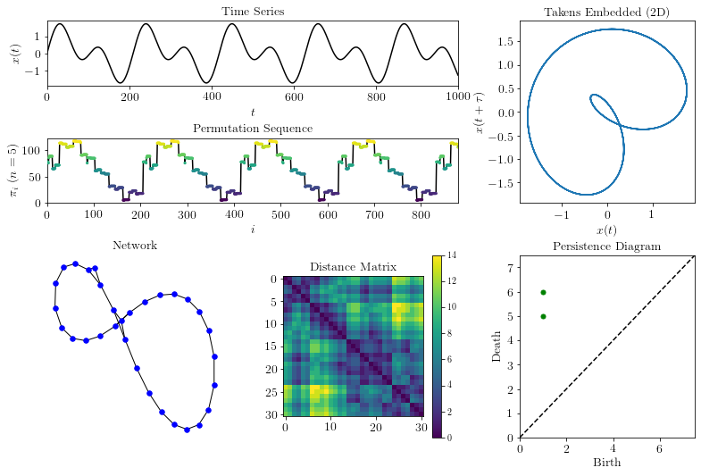

Persistent Homology of Networks (PHN)
======================================

This page provides a summary of the python functions used in "`Persistent Homology of Complex Networks for Dynamic State Detection <https://arxiv.org/abs/1904.07403>`_" for generating and analyzing complex networks as the Persistent Homology of Networks (PHN). Additionally, a basic example is provided showing the functionality of the method for a simple time series. Below, a simple overview of the method is provided.

Outline of method: a time series (a) is embedded (b) using state space reconstruction from Takens' embedding or segmenting the vectors into a set of permutations. From these two representations, an undirected, unweighted network (c) is formed by either applying a kth nearest neighbors algorithm or by setting each permutation state as a node. The distance matrix (d) is calculated using the shortest path between all nodes. The
persistence diagram (e) is generated by applying persistent homology to the distance matrix. Finally, one of several point summaries (f) are used to extract information from the persistence diagram.

.. automodule:: teaspoon.TDA.PHN
    :members:

Example
#########
The following is an example implementing the method for an ordinal partition network and shortest unweighted path distance for a simple periodic time series. However, other network types (e.g., k-NN or CGSSN) could be used and other distances (e.g., weighted shortest path or diffusion distance) could have been used. These other distances and networks are described in the signal processing module.::

    #import needed packages
    import numpy as np
    import matplotlib.pyplot as plt
    import matplotlib.gridspec as gridspec
    import networkx as nx
    
    #teaspoon functions
    from teaspoon.SP.network import ordinal_partition_graph
    from teaspoon.SP.network_tools import remove_zeros
    from teaspoon.SP.network_tools import make_network
    from teaspoon.TDA.PHN import DistanceMatrix, point_summaries, PH_network
    
    # Time series data
    t = np.linspace(0,30,600)
    ts = np.sin(t) + np.sin(2*t) #generate a simple time series

    A = ordinal_partition_graph(ts, n = 6) #adjacency matrix
    A = remove_zeros(A) #remove nodes of unused permutation
    G = nx.from_numpy_matrix(A)
    G.remove_edges_from(nx.selfloop_edges(G))
    #create distance matrix and calculate persistence diagram
    D = DistanceMatrix(A, method = 'diffusion_distance')
    diagram = PH_network(D)

    print('1-D Persistent Homology (loops): ', diagram[1])

    stats = point_summaries(diagram, A)
    print('Persistent homology of network statistics: ', stats)
    
    
    
    TextSize = 14
    plt.figure(2)
    plt.figure(figsize=(8,8))
    gs = gridspec.GridSpec(4, 2)
    
    ax = plt.subplot(gs[0:2, 0:2]) #plot time series
    plt.title('Time Series', size = TextSize)
    plt.plot(ts, 'k')
    plt.xticks(size = TextSize)
    plt.yticks(size = TextSize)
    plt.xlabel('$t$', size = TextSize)
    plt.ylabel('$x(t)$', size = TextSize)
    plt.xlim(0,len(ts))
    
    ax = plt.subplot(gs[2:4, 0])
    plt.title('Network', size = TextSize)
    nx.draw(G, with_labels=False, font_weight='bold', node_color='blue',
        width=1, font_size = 10, node_size = 30)
    
    ax = plt.subplot(gs[2:4, 1])
    plt.title('Persistence Diagram', size = TextSize)
    MS = 3
    top = max(diagram[1].T[1])
    plt.plot([0,top*1.25],[0,top*1.25],'k--')
    plt.yticks( size = TextSize)
    plt.xticks(size = TextSize)
    plt.xlabel('Birth', size = TextSize)
    plt.ylabel('Death', size = TextSize)
    plt.plot(diagram[1].T[0],diagram[1].T[1] ,'go', markersize = MS+2)
    plt.xlim(0,top*1.25)
    plt.ylim(0,top*1.25)
    
    plt.subplots_adjust(hspace= 0.8)
    plt.subplots_adjust(wspace= 0.35)
    plt.show()

Where the output for this example is::
	
    1-D Persistent Homology (loops):  [[ 1. 15.]]
    Persistent homology of network statistics:  [0.0, 0, 0.02127659574468085]

