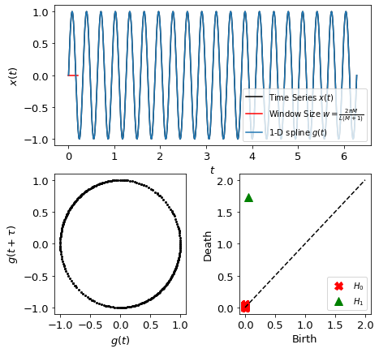

Sliding Windows for 1-dimensional Persistence Scoring: SW1PerS.
================================================================

The SW1PerS method is used to quanitfy the periodicity of a signal using 1 dimensional persistent homology of a sliding windows embedding.
For more details on the method please reference "Sliding Windows and Persistence: An Application of Topological Methods to Signal Analysis."

.. automodule:: teaspoon.TDA.SW1PerS
    :members:

The following is an example implementing the SW1PerS method for analyzing a periodic signal::

    #import packages
    import numpy as np
    from teaspoon.TDA.SW1PerS import sw1pers, N_sw1pers

    t = np.linspace(0,20, 1000)
    ts = np.sin(2*np.pi*t)
    
    #_Set parameters for SW1PerS__
    nT = 300 #number of points in point cloud
    N = N_sw1pers(ts, cutoff = 0.25, plotting = True)
    M = 2*N #embedding dimension
    L = 20 #number of periods in signal
    w = 2*np.pi*M/(L*(M+1)) #optimal window size from sw1pers theory
        
    # ______________Plotting________________________________________
    dgms = sw1pers(ts, w = w , M = M, nT = nT, plotting  = True)
    
    #_______________Printing Results________________________________
    print('Number of significant frequencies (N): ', N)
    print('Window Size:                           ', w)
    print('embedding dimension (M = 2N):          ', M)
    print('Periodicity Score:                     ', periodicity_score(dgms))

Where the output for this example is::

    Number of significant frequencies (N):  1
    Window Size:                            0.20943951023931953
    embedding dimension (M = 2N):           2
    Periodicity Score:                      0.02779281281152368

