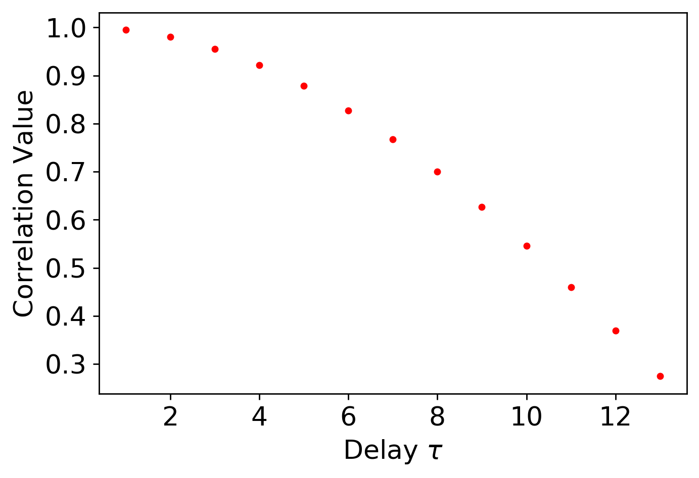
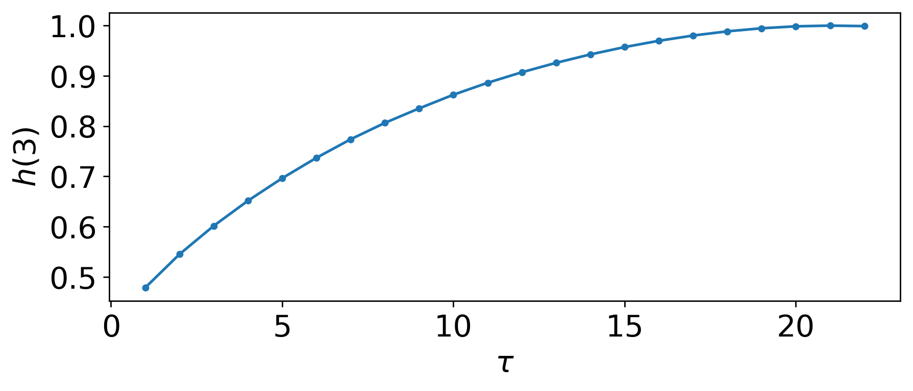
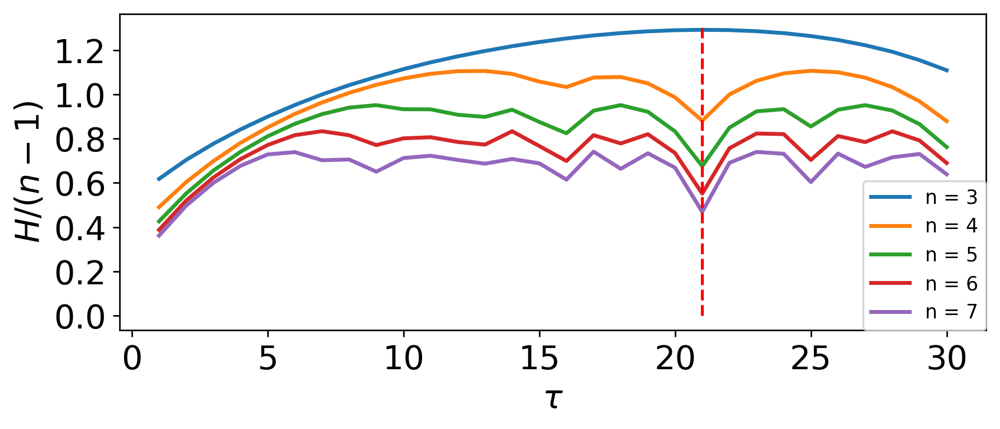
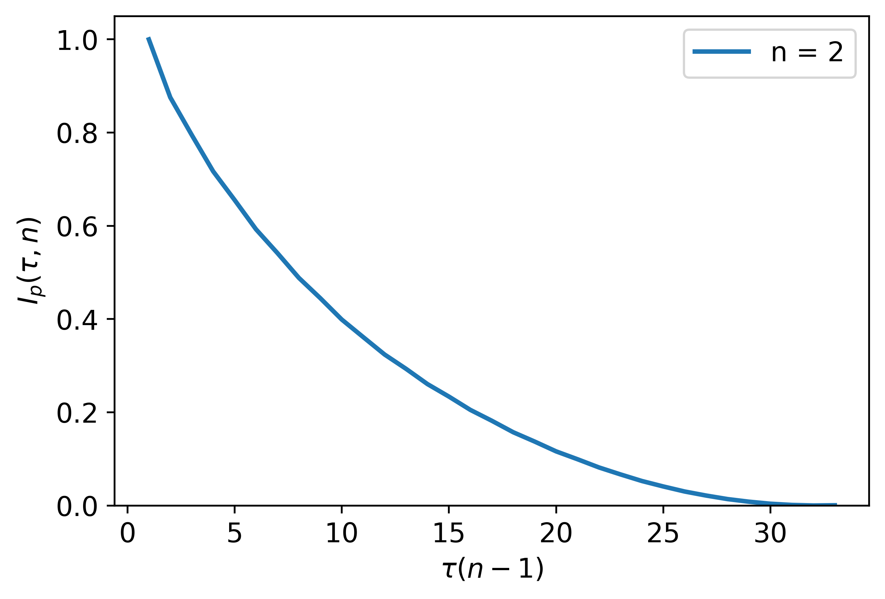
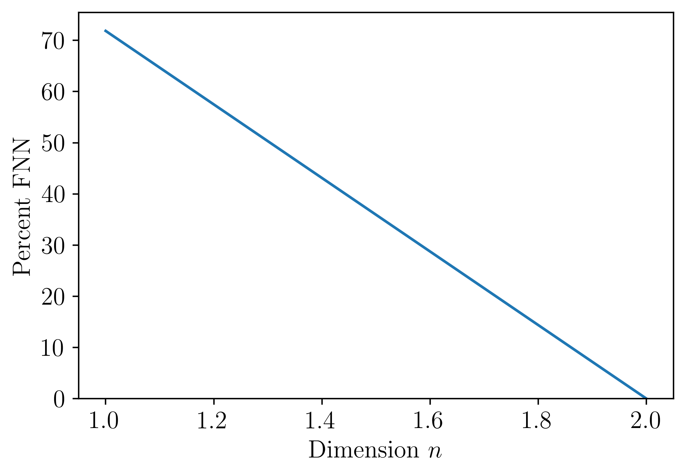

Parameter selection module documentation
=======================================================

This page provides a summary of the Python functions used in "`On the Automatic Parameter Selection for Permutation Entropy <https://arxiv.org/abs/1905.06443>`_" for automatically finding an appropriate dimension and delay for both delay embedding and permutations. To use this module, the following python packages are needed:

* numpy
* scipy
* pyentrp
* matplotlib
* pandas

.. automodule:: teaspoon.parameter_selection.MI_delay
    :members:

The following is an example implementing the MI method for selecting tau::

    import numpy as np
    
    fs = 10
    t = np.linspace(0, 100, fs*100) 
    ts = np.sin(t) + np.sin((1/np.pi)*t)
    
    tau = MI_for_delay(ts, plotting = True, method = 'basic', h_method = 'sturge', k = 2, ranking = True)
    print('Delay from MI: ',tau)

Where the output for this example is::

    Delay from MI:  23

.. figure:: figures/MI_fig.png
   :scale: 15 %

.. automodule:: teaspoon.parameter_selection.autocorrelation
    :members:

The following is an example implementing autocorrelation for selecting tau::

    import numpy as np
    import matplotlib.pyplot as plt
    from scipy.integrate import odeint
    from PE_parameter_functions import autocorrelation
    
    t = np.linspace(0, 100, 1000)
    ts = np.sin(t)

    Delay = autocorrelation.autoCorrelation_tau(ts, cutoff = 1/np.exp(1), AC_method = 'pearson', plotting = True) 
    #calculates delay from autocorrelation (Pearson's)
    
    print('Delay from AC: ', Delay)

Where the output for this example is::

    Delay from AC:   13

.. automodule:: teaspoon.parameter_selection.MsPE
    :members:

The following is an example implementing the MsPE method for selecting both n and tau::

    import numpy as np
    import matplotlib.pyplot as plt
    from PE_parameter_functions import MsPE
    
    t = np.linspace(0, 100, 1000)
    ts = np.sin(t)
    
    m_s, m_e, d_s, d_e = 3, 7, 1, 200
    #m_s and m_e are the starting and ending dimensions n to search through
    #d_e = max delay tau to search through
    
    #plotting option will show you how delay tau or dimension n were selected
    tau = int(MsPE.MsPE_tau(ts, d_e, plotting = True)) 
    n = MsPE.MsPE_n(ts, tau, m_s, m_e, plotting = True)
    
    print('Embedding Delay:       '+str(tau))
    print('Embedding Dimension:   '+str(n))

Where the output for this example is::

    Embedding Delay:       21
    Embedding Dimension:   3

.. automodule:: teaspoon.parameter_selection.delay_LMS
    :members:

The following is an example implementing the statistics of gaussian noise in the fourier spectrum and 
the sampling criteria from On the 0/1 test for chaos in continuous systems by Melosik and Marszalek 
for selecting tau::

    import numpy as np
    
    fs = 10
    t = np.linspace(0, 100, fs*100) 
    ts = np.sin(t) + np.random.normal(0,0.1, len(t))

    tau = LMSforDelay(ts, fs, plotting = True)
    print('Permutation Embedding Delay: ' + str(int(tau)))

Where the output for this example is::

    Permutation Embedding Delay: 19

.. figure:: figures/LMS_delay_PE_fig.png
   :scale: 13 %

.. automodule:: teaspoon.parameter_selection.PAMI_delay
    :members:

The following is an example implementing Permutation Auto-Mutual Information for the purpose of selecting tau::

    import numpy as np
    
    fs = 10
    t = np.linspace(0, 100, fs*100) 
    ts = np.sin(t)
    tau = PAMI_for_delay(ts, n = 5, plotting = True)
    print('Delay from PAMI: ',tau)

Where the output for this example is::

    Permutation Embedding Delay: 8

.. automodule:: teaspoon.parameter_selection.FNN_n
    :members:

The following is an example implementing the False Nearest Neighbors (FNN) algorithm for the dimension::

    import numpy as np
    
    fs = 10
    t = np.linspace(0, 100, fs*100) 
    ts = np.sin(t)

    tau=15 #embedding delay

    perc_FNN, n =FNN_n(ts, tau, plotting = True)
    print('FNN embedding Dimension: ',n)

Where the output for this example is::

    FNN embedding Dimension:  2

