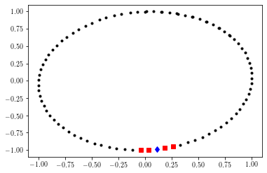

.. _tsa:

Time Series Analysis (TSA) Tools
====================================

The following are the available TSA functions:

* :ref:`takens`
* :ref:`permutation_sequence`
* :ref:`knn`
* :ref:`cgss_binning`
* :ref:`cgss_sequence`

Further detailed documentation and examples are provided below for each (or click link).

.. _takens:

Takens' Embedding
*******************

The Takens' embedding algorhtm reconstructs the state space from a single time series with delay-coordinate embedding as shown in the animation below.

.. image:: figures/takens_embedding_gif_v2.gif
   :class: with-shadow float-center
   :scale: 35

Figure: Takens' embedding animation for a simple time series and embedding of dimension two. This embeds the 1-D signal into n=2 dimensions with delayed coordinates.

.. rst-class::  clear-both

.. automodule:: teaspoon.SP.tsa_tools
    :members: takens
    :noindex:

The two parameters needed for state space reconstruction (Takens' embedding) are the delay parameter and dimension parameter. These can be selected automatically from the parameter selection module ( :ref:`parameter_selection`).

**Example**::

    import numpy as np
    t = np.linspace(0,30,200)
    ts = np.sin(t)  #generate a simple time series
    
    from teaspoon.SP.tsa_tools import takens
    embedded_ts = takens(ts, n = 2, tau = 10)
    
    import matplotlib.pyplot as plt
    plt.plot(embedded_ts.T[0], embedded_ts.T[1], 'k.')
    plt. show()

Output of example:

.. figure:: figures/takens_example.png
   :scale: 70 %

.. _permutation_sequence:

Permutation Sequence Generation
**********************************

The function provides an array of the permutations found throughout the time series as shown in the 

.. image:: figures/permutation_sequence_animation.gif
   :class: with-shadow float-center
   :scale: 45

Figure: Permutation sequence animation for a simple time series and permutations of dimension three.

.. rst-class::  clear-both

.. automodule:: teaspoon.SP.tsa_tools
    :members: permutation_sequence
    :noindex:

The two parameters needed for permutations are the delay parameter and dimension parameter. These can be selected automatically from the parameter selection module ( :ref:`parameter_selection`).

**Example**::

    import numpy as np
    t = np.linspace(0,30,200)
    ts = np.sin(t)  #generate a simple time series
    
    from teaspoon.SP.tsa_tools import permutation_sequence
    PS = permutation_sequence(ts, n = 3, tau = 12)
    
    import matplotlib.pyplot as plt
    plt.plot(t[:len(PS)], PS, 'k')
    plt. show()

Output of example:

.. figure:: figures/PS_example.png
   :scale: 70 %

.. _knn:

k Nearest Neighbors
***********************

.. automodule:: teaspoon.SP.tsa_tools
    :members: k_NN
    :noindex:

**Example**::

    import numpy as np
    t = np.linspace(0,15,100)
    ts = np.sin(t)  #generate a simple time series
    
    from teaspoon.SP.tsa_tools import takens
    embedded_ts = takens(ts, n = 2, tau = 10)
    
    from teaspoon.SP.tsa_tools import k_NN
    distances, indices = k_NN(embedded_ts, k=4)
    
    
    import matplotlib.pyplot as plt
    plt.plot(embedded_ts.T[0], embedded_ts.T[1], 'k.')
    i = 20 #choose arbitrary index to get NN of.
    NN = indices[i][1:] #get nearest neighbors of point with that index.
    plt.plot(embedded_ts.T[0][NN], embedded_ts.T[1][NN], 'rs') #plot NN
    plt.plot(embedded_ts.T[0][i], embedded_ts.T[1][i], 'bd') #plot point of interest
    plt. show()

Output of example:

.. _cgss_binning:

Coarse grained state space binning
****************************************
Please reference publication "Persistent Homology of the Coarse Grained State Space Network" for details.

.. automodule:: teaspoon.SP.tsa_tools
    :members: cgss_binning
    :noindex:

.. _cgss_sequence:

Coarse grained state space state sequence
***************************************************
Please reference publication "Persistent Homology of the Coarse Grained State Space Network" for details.

.. automodule:: teaspoon.SP.tsa_tools
    :members: cgss_sequence
    :noindex:

